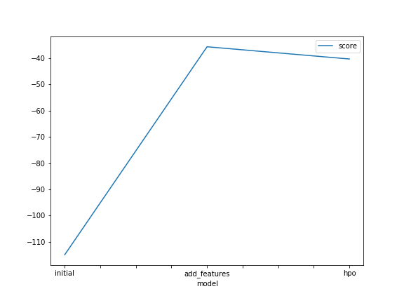
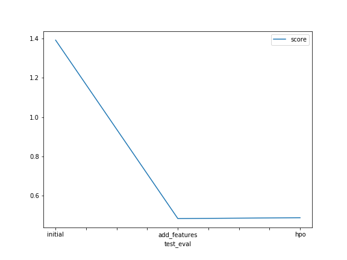

# Report: Predict Bike Sharing Demand with AutoGluon Solution
#### Sami Bensaida (cyanmage in github and samitotov in kaggle)

## Initial Training
### What did you realize when you tried to submit your predictions? What changes were needed to the output of the predictor to submit your results?
Some predictions had a negative score, that makes no sense. So they have been put simply to 0.

### What was the top ranked model that performed?
The one called "add_features"; it was difficult to find better hyperparameters for "hpo". But twice were very close.

## Exploratory data analysis and feature creation
### What did the exploratory analysis find and how did you add additional features?
The score was not so good without "feature engineering" (1.39306). 
The date was litterally exploited as string, so not so relevant informationally.
So splitting the date into (year, month, day, hour) columns may expose explicitly the information related to seasonality, day/night hours, and so on...

### How much better did your model preform after adding additional features and why do you think that is?
The new score obtained (0.48152) is a great improvement, so it was needed to extract efficiently the information from the too compacted string format for the date.

## Hyper parameter tuning
### How much better did your model preform after trying different hyper parameters?
Not so great... And even I lose a little bit in performance (0.48591)
Maybe, there was a better search domain in the hyperparameter space. It was difficult to guess.

### If you were given more time with this dataset, where do you think you would spend more time?
- Trying to find bias in the distribution of features, to see if I could better tune separately in subdomains (very intuitive point of view).
- Trying to collect other "physical" or related to reality features : economical or ecological awareness, hiking activities for schools...
- Let the autogluon algorithm search for 10 minutes instead of 2 minutes.

### Create a table with the models you ran, the hyperparameters modified, and the kaggle score.
|model|hpo1|hpo2|hpo3|score|
|--|--|--|--|--|
|initial|Default value|Default value|Default value|1.39306|
|add_features|Default value|Default value|Default value|0.48152|
|hpo|100|100|25|0.48591|

model 	gbm_options:num_boost_round 	xgb_options:n_estimators 	nn_options:num_epochs 	score
0 	initial 	Default value 	Default value 	Default value 	1.39306
1 	add_features 	Default value 	Default value 	Default value 	0.48152
2 	hpo 	100 	100 	25 	0.48591

### Create a line plot showing the top model score for the three (or more) training runs during the project.

TODO: Replace the image below with your own.

### Create a line plot showing the top kaggle score for the three (or more) prediction submissions during the project.

TODO: Replace the image below with your own.

## Summary
Exploratory data analysis is manadatory to improve models performance. Perhaps it is a state of the art, but some common and proven recipes 
may lead to better results. Moreover, knowing the domain of exploration or asking experts to get more relevant information are also good practices.
Tuning hyperparameters may be another improvement, but it appears to be not so efficient as a good exploration, transformation and exploitation of data.
